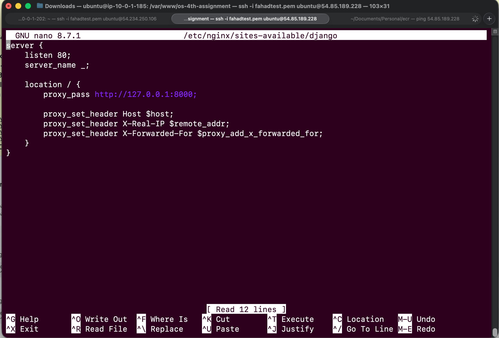
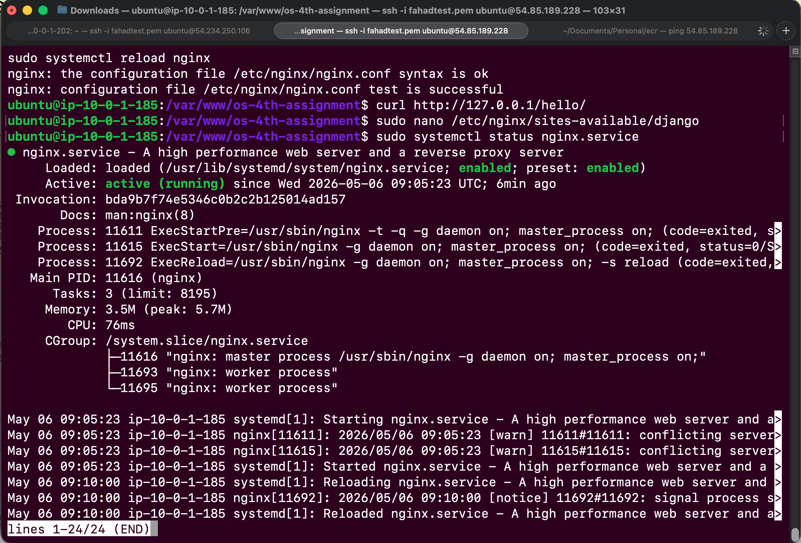
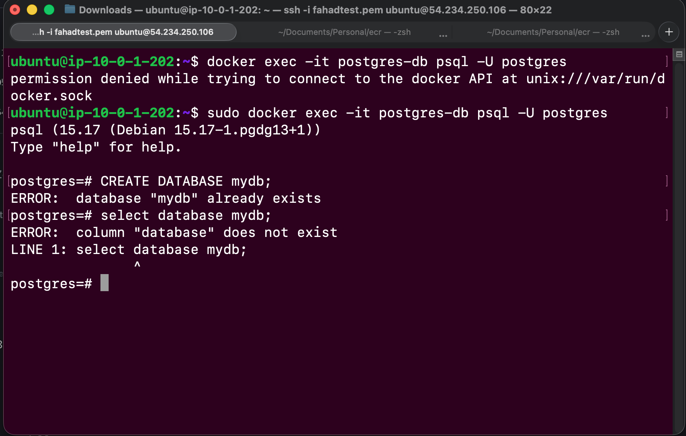
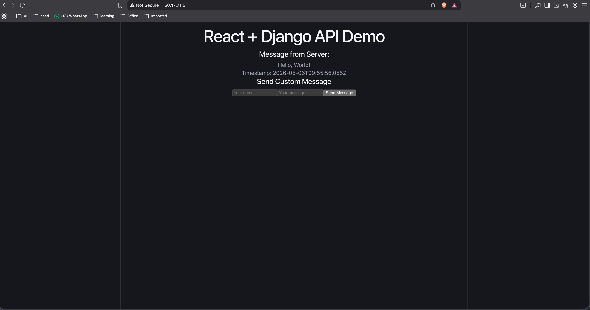

# 4th assignment
---

### Flow
Client → Nginx → Docker (Gunicorn) → Django API → PostgreSQL

---

## 🎨 Frontend (React Vite + Nginx)

- Built using Vite (`dist/`)
- Served as static files using Nginx
- Communicates with backend via REST API

### Flow
Client → Nginx → React static build → Backend API

---

## 🗄️ Database (PostgreSQL)

- Hosted on separate EC2 instance
- Connected securely from backend server
- Stores all application data

---

## 📸 Evidence (Screenshots)

### Backend Nginx Configuration

### Backend Running Confirmation

### Database Setup

### Frontend Running Confirmation

---

## 🌐 Nginx Role

- Reverse proxy for Django backend
- Static file hosting for React frontend
- Handles routing and request forwarding

---

## 🚀 Deployment Summary

- Backend: Django + Docker + Gunicorn + Nginx
- Frontend: React (Vite build) + Nginx
- Database: PostgreSQL (separate EC2)
- Communication: REST API between services

---

## 📌 Notes

- Ensure EC2 security groups allow:
  - HTTP (80)
  - HTTPS (443 optional)
  - Backend internal communication ports if needed

- HTTPS can be enabled using Certbot (`sudo certbot --nginx`)
- Backend uses Docker for isolation and scalability

---
